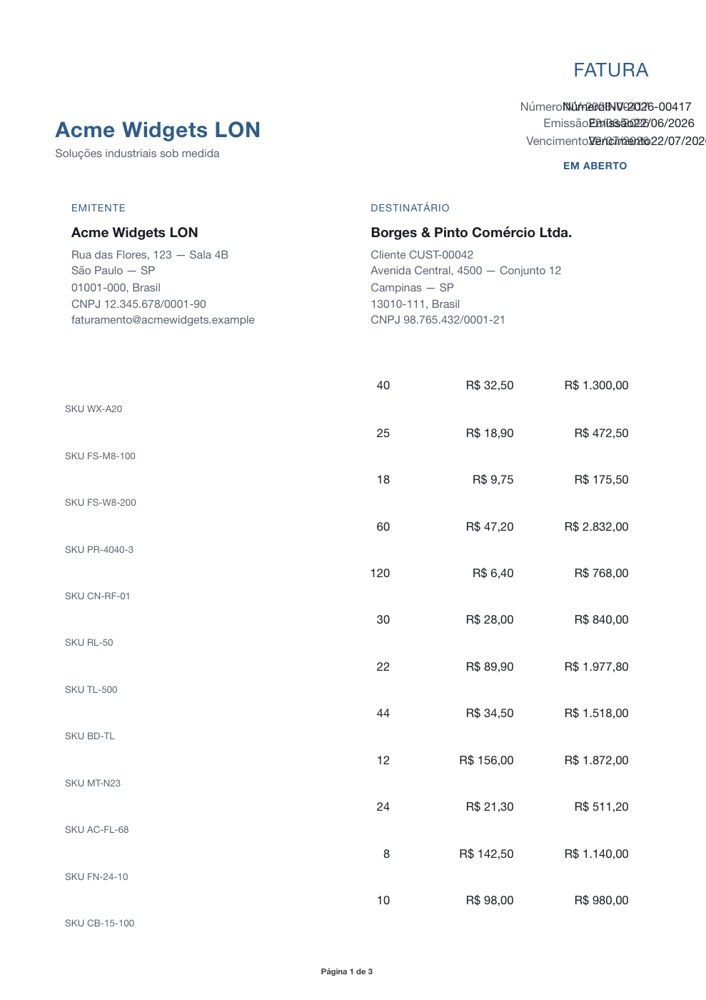

# vellora

**HTML → PDF for Node.js. No Chromium. No browser. No system install — runs on slim Linux images and AWS Lambda.**

[](https://github.com/diomalta/vellora/actions/workflows/ci.yml)


<!-- npm version badge — enable on first publish:
[](https://www.npmjs.com/package/vellora) -->

`npm install` and it works — a native, in-process renderer for **generated documents**
(invoices, receipts, statements, boletos, notifications). No `apt install`, no Puppeteer
browser download, no `npx playwright install`, no sidecar service. It produces a **smaller
PDF** than a headless browser — there's no browser-engine overhead in the output.

```bash
npm install vellora
```

<p align="center">
  
  <br><em>A multi-page invoice template rendered to PDF — in-process, selectable text, repeated table header.</em>
</p>

> 🚧 **Status: pre-release / alpha — in active development.** Some of the API below is the **design
> target**, not yet shipped (see the *What works today* note). Track progress in
> [Status & roadmap](#status--roadmap) and the design in [ARCHITECTURE.md](./ARCHITECTURE.md).

## Why

Browser-based PDF (Puppeteer/Playwright) means shipping Chromium: a large browser download, dozens
of system libraries in your Docker image, multi-second cold starts, and a per-render memory
footprint that can OOM-kill under concurrency. vellora takes a different path — a **native addon
(napi-rs) that renders inside your Node process**:

- ✅ `npm install`, nothing installed "outside" (slim Linux + Lambda arm64; musl/Alpine prebuilt is a fast-follow)
- ✅ no browser to launch and no subprocess per render
- ✅ designed for bounded memory + real concurrency on the libuv thread pool
- ✅ selectable, searchable text + subset-embedded fonts (small PDFs)
- ✅ `@page` page numbers and running headers/footers (which `chrome --print-to-pdf` can't do via CSS)
- ✅ PDF/A, PDF/UA, tagged PDF for compliance *(planned)*
- ✅ **deterministic** output — same template + data ⇒ byte-stable PDF

> **Performance claims are evidence-gated.** Reproducible benchmarks vs Puppeteer, Playwright,
> Gotenberg, and WeasyPrint (cold start, RSS under concurrency, output size, throughput, image size)
> live in [`benchmarks/`](./benchmarks/). Numbers are published here once the suite runs in CI —
> we measure our own, we don't borrow them.

vellora is **not** a browser clone. It renders a documented HTML/CSS **subset** built for
documents, and tells you — precisely — when your input leaves it. **Strict by default.**

## What works today vs. design target

| Surface | Status |
|---|---|
| `renderPdf(html, data?, opts)` — render + built-in templating, strict subset | **Implemented** |
| `renderPdfToStream(...)` — render to a writable/HTTP response | **Implemented** (PDF buffered then written; progressive emission is planned) |
| `renderTemplate(...)` — templating only | **Implemented** |
| `@vellora/lint` `diagnose()` / `fix()` | **Planned — stub**, not yet usable |
| `npx vellora lint` / `vellora fix` (CLI) | **Planned — stub**, not yet usable |

## Quick start

```ts
import { renderPdf } from "vellora";

const pdf = await renderPdf(invoiceHtml, data, {
  metadata: { title: "Invoice INV-2026-00417", creationDate: "2026-06-23T00:00:00.000Z" },
  strict: true, // default — fails clearly on unsupported HTML/CSS
});
// pdf: Uint8Array
```

Built-in templating (no extra library):

```html
<table>
  <thead><tr><th>Item</th><th>Total</th></tr></thead>
  <tbody>
    
      <tr><td>{{ row.name }}</td><td>{{ row.total | currency("BRL") }}</td></tr>
    
  </tbody>
</table>
```

Stream straight to an HTTP response or upload:

```ts
import { renderPdfToStream } from "vellora";
await renderPdfToStream(invoiceHtml, res, data);
```

Runnable recipes live in [`examples/`](./examples) — `npm run example` (invoice),
`npm run render-receipt`, `render-boleto`, `render-notification`, `render-to-http-stream`,
`batch-concurrency`.

## Keep your templates in the subset (dev-time, not runtime) — *planned*

> ⚠️ **Stub:** the `@vellora/lint` API and the `vellora` CLI below are the design target and
> are **not usable yet**. Today, strict mode at render time tells you precisely when input leaves the
> subset (`VelloraUnsupportedError` with `{ feature, line, col, hint }`).

The plan: fixing happens at **authoring/CI time**, like a linter — never silently at render time.

```bash
npx vellora lint   templates/invoice.html        # report only      (planned)
npx vellora fix    templates/invoice.html --write # auto-fix         (planned)
```

## Compatibility

vellora renders a documented HTML/CSS **subset**. The full, generated reference — every supported,
partial, unsupported, and dev-time-fixable feature — is in **[COMPATIBILITY.md](./COMPATIBILITY.md)**
(generated from the strict-gate denylist, so it can't drift from the code).

| Feature | Status |
|---|---|
| Block & inline text, headings, lists | Supported |
| Tables (incl. multi-page, repeated header) | Supported |
| Images: PNG / JPEG / WebP | *Planned* |
| Inline SVG | Via dev-time `fix` (rasterized to PNG) — *planned* |
| `@page` margins, page numbers, running header/footer | Supported |
| Fonts: text shaping + subset embedding | Supported — custom fonts *planned* |
| PDF/A, PDF/UA, tagged, bookmarks, metadata | *Planned* |
| `display: flex` / `grid` (general) | Limited — use tables |
| JavaScript, browser APIs, animations, filters | Not supported (rejected by the strict gate) |

## How it compares

Honest positioning — including where vellora is **weaker**. *Found something inaccurate?
[Open a PR](https://github.com/diomalta/vellora/issues).*

| Tool | Engine / runtime | In-process? | Headless browser? | License | Best for |
|---|---|---|---|---|---|
| **vellora** | Rust (napi addon) | ✅ yes | ❌ no | MIT | Generated documents, serverless/Alpine, small deterministic PDFs |
| Puppeteer / Playwright | Chromium | ❌ no (browser) | ✅ yes | Apache-2.0 | Full-fidelity web pages, screenshots, JS-driven content |
| Gotenberg | Chromium + LibreOffice (Docker) | ❌ no (HTTP sidecar) | ✅ yes | MIT | Office docs + HTML via a standalone service |
| WeasyPrint | Python | ✅ (in Python) | ❌ no | BSD | HTML/CSS→PDF in Python stacks |
| Prince / DocRaptor | Proprietary engine | ❌ service/binary | ❌ no | Commercial | Advanced print CSS, paid SLA |
| wkhtmltopdf | Old WebKit | ✅ (binary) | ❌ no | LGPL | **Archived (2023)** — vellora is a migration target |
| pdfkit / pdf-lib / @react-pdf | JS, programmatic | ✅ yes | ❌ no | MIT | Drawing PDFs by hand/JSX (you don't write HTML/CSS) |

**Where vellora is weaker:** it renders a **documented subset** of HTML/CSS, not the full web
platform. A headless browser (Puppeteer/Playwright) supports far more CSS, JavaScript, and arbitrary
web content. If you need pixel-perfect rendering of an arbitrary website, use a browser; vellora is
for **generated documents** whose markup you control.

## Status & roadmap

vellora is **pre-release (alpha)**. The *What works today* table above is the API surface; this is
the broader feature view. Order is roughly build order, not a delivery commitment.

- **Available now** — in-process HTML→PDF (no browser); multi-page layout (text, headings, lists,
  tables); table pagination with a repeated `<thead>`; `@page` margins, page numbers, running
  header/footer; selectable text with subset-embedded fonts; deterministic (byte-identical) output;
  templating (`{{ var }}`, `` / ``, `currency` / `number` / `date` helpers);
  strict-by-default subset validation; `renderPdf` / `renderPdfToStream`; document metadata
  (`title`, `creationDate`).
- **In progress / next** — custom fonts (`fonts` option); image rendering (``, `images` /
  `baseUrl`); `@vellora/lint` + `@vellora/cli` (currently stubs); best-effort mode
  (`{ strict: false }`); more document fixtures (boleto, notification, receipt); bounded,
  configurable concurrency; prebuilt binaries for macOS + Linux glibc via CI (musl/Alpine is a fast-follow).
- **Planned for a stable release** — PDF/A · PDF/UA · tagged PDF · bookmarks; content-hash caching
  and phase timings; CI quality gates (generated compatibility table, visual-regression, our own
  benchmarks vs Chromium/Gotenberg/WeasyPrint); a stable semver API and a published docs site.
- **Future (post-1.0, demand-driven)** — password / encryption; attachments (PDF/A-3, e.g. embedding
  NF-e XML); watermark / stamp; broader CSS subset; more `fix` rules; more image formats; an optional
  `@vellora/chromium` fallback **only if** real demand appears for templates outside the subset.
- **Out of scope** — JavaScript execution · arbitrary-website fidelity · WASM build · Windows
  prebuilds · bundled Chromium by default.

## Packages

| Package | What |
|---|---|
| `vellora` | Public API + templating |
| `@vellora/native` | Prebuilt napi addons (linux glibc, macOS) |
| `@vellora/lint` | Dev-time `diagnose` + `fix` *(stub)* |
| `@vellora/cli` | `render` / `lint` / `fix` commands *(stub)* |

## Try it without installing

Open the repo in a ready-to-run environment (Rust + Node provisioned), then `npm run build && npm run example`:

[](https://codespaces.new/diomalta/vellora)

A one-command Docker demo is in [`Dockerfile.example`](./Dockerfile.example).

## Documentation

- [COMPATIBILITY.md](./COMPATIBILITY.md) — the supported HTML/CSS subset (generated)
- [ARCHITECTURE.md](./ARCHITECTURE.md) — design, layers, dependency stack, performance model
- [Status & roadmap](#status--roadmap) — what's shipping when
- [CONTRIBUTING.md](./CONTRIBUTING.md) — toolchain, dev loop, how to help
- [SECURITY.md](./SECURITY.md) — disclosure policy + native-addon threat model
- [RELEASING.md](./RELEASING.md) — release pipeline (Changesets + prebuilds + provenance)
- A full documentation site (VitePress) is scaffolded in [`docs/`](./docs).

## Contributing

vellora is pre-release and contributions are welcome — see [CONTRIBUTING.md](./CONTRIBUTING.md) and
the [good first issues](https://github.com/diomalta/vellora/contribute).

## License

MIT — see [LICENSE](./LICENSE).

---

⭐ **Star the repo to follow the launch**, track the [status](#status--roadmap), or open an issue with
your document use case.
