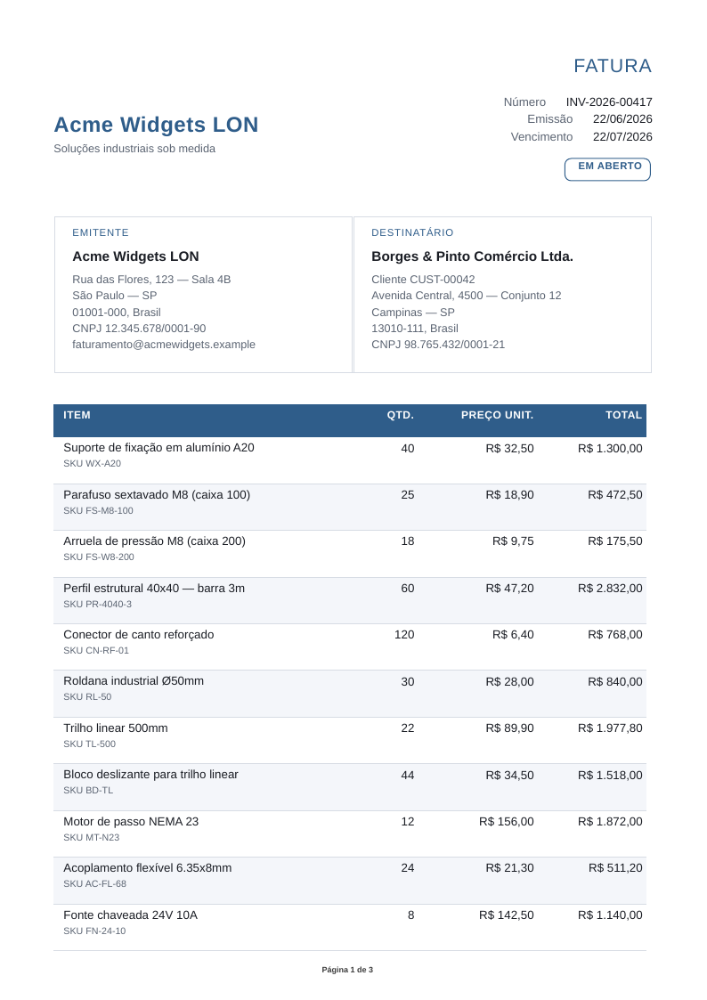
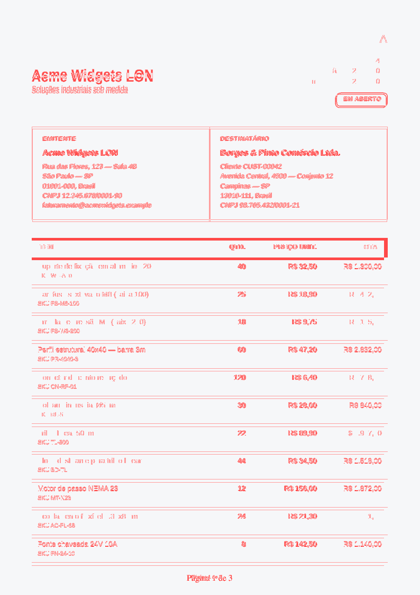

# vellora

**HTML to PDF for Node.js, native and browserless by default.**

[](https://github.com/diomalta/vellora/actions/workflows/ci.yml)


[](https://www.npmjs.com/package/vellora)

vellora renders generated document HTML - invoices, receipts, statements, boletos, notifications -
through a native napi-rs addon. The default path does not install Puppeteer, Playwright, Chromium, or
a sidecar service.

```bash
npm install vellora
```

Supported prebuilds today: macOS arm64/x64 and Linux glibc x64/arm64. musl/Alpine and Windows
prebuilds are not published yet.

## Quick Start

```ts
import { renderPdf } from "vellora";

const pdf = await renderPdf(invoiceHtml, data, {
  metadata: { title: "Invoice INV-2026-00417", creationDate: "2026-06-23T00:00:00.000Z" },
  strict: true,
});
```

Use the native path when your template fits vellora's documented subset. For templates that need
browser print fidelity, install the optional engine and provide a Chrome/Chromium executable:

```bash
npm install vellora @vellora/engine-chromium
```

```ts
const pdf = await renderPdf(html, data, {
  engine: "chromium",
  chromium: { executablePath: "/path/to/chrome", timeoutMs: 30_000 },
});
```

## What Ships In 0.1.0

| Area | Status |
|---|---|
| Native render API | `renderPdf`, `renderPdfBatch`, `renderPdfToStream` |
| Templates | `{{ value }}`, ``, ``, `currency`, `number`, `date` |
| Strict subset validation | Default behavior; unsupported input rejects before PDF output |
| Best-effort fixing | `{ strict: false }` runs `@vellora/lint` fixers before render |
| Assets | Caller-supplied image bytes, data URL images, custom font bytes |
| PDF output | Deterministic bytes, selectable text, embedded font subsets, metadata, PDF/A-2b |
| CLI | `vellora render`, `lint`, `fix`, `doctor`, `fidelity` |
| Fidelity routing | `engine: "native"`, `engine: "chromium"`, and `engine: "auto"` policy files |

## Compatibility

vellora is not a browser clone. It targets generated documents whose markup you control.

Supported or documented today:

- block and inline text, headings, lists, and tables, including repeated `<thead>` across pages
- `@page` margins, page counters, running headers/footers
- PNG, JPEG, GIF, and WebP images via data URLs or the `images` option
- custom TTF/OTF font bytes via the `fonts` option
- PDF/A-2b archival output
- partial flexbox behavior; prefer tables for reliable document layout
- dev-time fixes for common issues such as inline SVG and grid/flex inside table cells

Unsupported on the native path:

- JavaScript execution and browser APIs
- arbitrary website rendering
- network fetching of image/font assets
- interactive forms, media elements, canvas, iframe/object/embed
- full CSS grid/flex/browser layout fidelity

The generated source of truth is [COMPATIBILITY.md](./COMPATIBILITY.md).

## Evidence

Visual evidence is generated from the repo fixtures against the optional Chromium engine:
[report](./docs/assets/visual-evidence/index.html),
[manifest](./docs/assets/visual-evidence/manifest.json).

<p align="center">
  
  
  <br>
  <sub>Invoice fixture: native render and native-vs-Chromium diff.</sub>
</p>

Resource numbers come from
[Resource Benchmarks run 28302742627](https://github.com/diomalta/vellora/actions/runs/28302742627)
on pinned Linux CI, Node v22.23.0, 4 cores:

| Path | Fresh install | External runtime | RSS @8 | External RSS @8 | Warm median / p95 |
|---|---:|---:|---:|---:|---:|
| Native `vellora` | 28.93 MB | N/A | 116.51 MB | N/A | 17.47 / 17.96 ms |
| Vellora Chromium | 28.94 MB | 412.28 MB | N/A | 6425.81 MB | 491.85 / 509.43 ms |

Puppeteer and Playwright are included in the benchmark artifact but are not quoted as comparable here
because that run marked them non-comparable for the fixture (`page count 1 != reference 3`).

## Packages

| Package | Purpose |
|---|---|
| `vellora` | Public API, templating, orchestration |
| `@vellora/native` | Host prebuild loader for the napi addon |
| `@vellora/lint` | Dev-time `diagnose()` and `fix()` |
| `@vellora/cli` | Command line workflows |
| `@vellora/engine-chromium` | Optional browser-fidelity engine using a host-supplied Chrome/Chromium |

## Docs

- [Docs site](https://diomalta.github.io/vellora/)
- [COMPATIBILITY.md](./COMPATIBILITY.md)
- [ARCHITECTURE.md](./ARCHITECTURE.md)
- [benchmarks/](./benchmarks/)
- [RELEASING.md](./RELEASING.md)
- [SECURITY.md](./SECURITY.md)

## License

MIT - see [LICENSE](./LICENSE).
